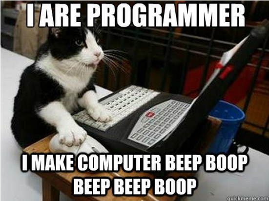

---
output:
  ioslides_presentation:
    fig_height: 3
    fig_width: 4
    self_contained: yes
---

## An Introduction to R

Feb 10-11, 2016


## Why R?

R is a versatile, open source programming/scripting language that's useful 
 for statistics but also any data-oriented tasks (including plotting).

* Open source software under GPL.  
* Superior (if not just comparable) to commercial alternatives.
* Over 5,000 user contributed packages at this time. 
* Widely used both in academia and industry.  
* Available on all platforms.
* Large and growing community of peers.

**It will make you more efficient and your work more repeatable and reliable**

## Objectives

* Introduction to R and RStudio, and some of the fundamentals of R
* Getting acquainted with some of the basics of working with data in R
* Data Visualization (plotting)
* Data "Munging" (manipulation)
* Performing basic statistical analyses
* Repeating things
* Writing Functions
* Best Practices
* How to get help

----

<div class="centered"></div>

---

<div class="centered"></div>

## Why R?

* Its really important that you know what you did.
* A lot of scientific work is *not* reproducible.
* If you keep a lab or field notebook, why are we not as careful with our data? 
* We edit each others manuscripts, but we don't edit each other's code. 
* If you write your code with "future you" in mind, you will save yourself and 
  others a lot of time.
* Code and workflow is more reproducible if we can document everything that we do.
* Our end goal is not just to "do stuff" but to do it in a way that anyone can 
  easily and exactly replicate our workflow and results.

## Mathematical Operations

From highest to lowest precedence:

 * Parentheses: `(`, `)`
 * Exponents: `^`
 * Divide: `/`
 * Multiply: `*`
 * Add: `+`
 * Subtract: `-`

## Comparing things

```{r, eval=FALSE}
1 == 1  # equality (note two equals signs, read as "is equal to")
```

```{r, eval=FALSE}
1 != 2  # inequality (read as "is not equal to")
```

```{r, eval=FALSE}
1 <  2  # less than
```

```{r, eval=FALSE}
1 <= 1  # less than or equal to
```

```{r, eval=FALSE}
1 > 0  # greater than
```

```{r, eval=FALSE}
1 >= -9 # greater than or equal to
```

## Functions

Most of R's power and flexibility comes from _functions_. 

A function is a saved object that takes inputs to perform a task.

Functions take in information and return outputs.

A function takes zero, one, or many _arguments_ (also called _parameters_), 
depending on the function, and _returns_ a value. 

To call a function, type its name followed by brackets `()`. Arguments go inside 
the brackets and are separated by commas.

```{r eval=FALSE}
name_of_function(arg1,arg2,arg3)
```

## RStudio

#### Projects - keeping things organized

* Keep all your project files in one self-contained, well-organized directory

```
project
├── R
│   └── functions.R
├── data
│   ├── data1.csv
│   └── data2.csv
├── doc
│   └── manuscript.doc
├── out
│   └── summaries.csv
├── plots
│   ├── plot1.png
│   └── plot2.png
├── 01-load_clean_data.R
├── 02-analysis.R
├── 03-plotting.R
└── my_project.Rproj
```

## Naming Things

> *"There are only two hard things in Computer Science: cache invalidation and 
> naming things."*
> -- Phil Karlton

* Name things so that you can understand them later
* Try to balance brevity with clarity: `x` is easy to type, but may not mean much. 
* Only begin names with letters.
* Separate words with a dot (`my.var`) or an underscore (`my_var`), or use 
`camelCase`.
* Try to be consistent.
* Avoid giving things names that already exist (like `mean`, `sum`, `log`)

## Data Types in R

* **character**: `"a"`, `"swc"`
* **numeric**: `2`, `15.5`
* **integer**: `2L` (the `L` tells R to store this as an integer)
* **logical**: `TRUE`, `FALSE`
* **complex**: `1+4i` (complex numbers with real and imaginary parts)

## ggplot2

Grammer of Graphics:

- data
- aesthetics
  - map _varirables_ to _visual representation_
  - x, y, colour, size, etc.
- geom layer(s)
- optional
   - stat
   - facets
   
## Data subsetting

Access a single column:
```{r, eval=FALSE}
mydf$col_name
```

Subset rows and columns:
```{r, eval=FALSE}
my_df[rows, columns]
```
`rows` and `columns` can be integers, character, or logical

## dplyr

`dplyr` implements the following verbs useful for data manipulation:

* `group_by()`: set the grouping variable(s)
* `filter()`: focus on a subset of rows
* `select()`: focus on a subset of variables
* `mutate()`: add new columns (also `mutate_each()`)
* `summarize()`: reduce each group to a single row of summary statistics 
* `arrange()`: re-order the rows

## dplyr: `select()`


## dplyr: `group_by()`


## dplyr: `summarize()`


## tidyr - Tidy data


